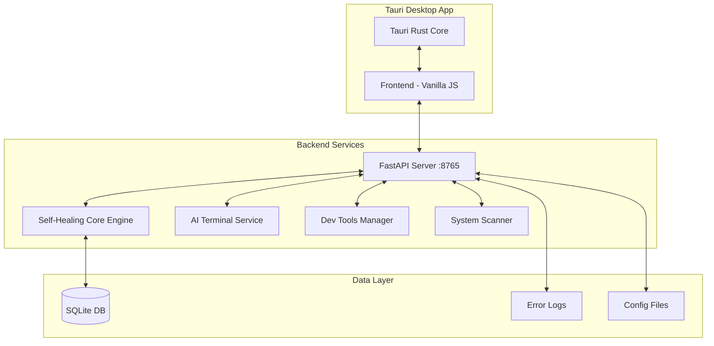

# Design Document

## Overview

This design addresses final improvements to PC Doctor, a Tauri desktop application with FastAPI Python backend and vanilla JavaScript frontend. The improvements focus on UI/UX consistency, performance optimization, error handling, and system stability across 12 key areas.

The application architecture consists of:
- **Frontend**: Vanilla JavaScript with Tauri webview rendering
- **Backend**: FastAPI Python server running on localhost:8765 
- **Desktop Shell**: Tauri Rust application framework
- **Database**: SQLite for SHCE queue and knowledge management

## Architecture

### Current System Components



### Module Organization

The improvements target these existing modules:
- **Control Center**: Main SHCE interface with tabs (Overview, Repair Queue, Error Monitor, Knowledge Base, History, Environment)
- **Dev Tools**: Development tool discovery and management
- **AI Terminal**: Interactive AI diagnostic agent
- **Performance Layer**: Rendering and scroll optimization
- **Error Handling**: EPIPE and connection management

## Components and Interfaces

### 1. Control Center Tab System

**Current Implementation**: Control Center exists with multiple tabs but lacks consistency in the Error Monitor tab.

**Enhanced Tab Controller**:
```javascript
class ControlCenterTabs {
    constructor() {
        this.tabs = ['overview', 'repair-queue', 'error-monitor', 'knowledge-base', 'history', 'environment'];
        this.activeTab = 'overview';
        this.transitionDuration = 300; // ms
    }
    
    switchTab(tabId) {
        // Consistent transition animations
        // State management
        // Layout preservation
    }
    
    renderTab(tabId) {
        // Unified rendering patterns
        // Consistent styling application
    }
}
```

### 2. Error Monitor Enhancement

**Current State**: Error Monitor tab exists but needs layout consistency and clear button.

**Enhanced Error Monitor**:
```javascript
class ErrorMonitorTab {
    constructor(errorLogService) {
        this.errorLogService = errorLogService;
        this.clearButton = null;
    }
    
    render() {
        // Apply consistent tab layout patterns
        // Add Clear Resolved Logs button
        // Maintain visual consistency with other tabs
    }
    
    clearResolvedLogs() {
        // Remove non-pending logs from database
        // Refresh display
        // Update button state
    }
}
```

### 3. Repair Queue Command Synchronization

**Current Issue**: Commands in Repair Queue UI may not match actual execution.

**Synchronized Command Manager**:
```python
class RepairCommandManager:
    def __init__(self, db_connection):
        self.db = db_connection
    
    def update_command(self, error_id: str, new_command: str):
        """Update command in both UI state and SHCE database"""
        # Update selected_candidate field in queue table
        # Notify UI of changes
        # Maintain command consistency
    
    def get_display_command(self, error_id: str) -> str:
        """Get current command for UI display"""
        # Query from single source of truth
        # Return formatted command
```

### 4. Dev Tools Application Management

**Current Gap**: Tools installed via search don't automatically appear in Installed Apps.

**Application Lifecycle Manager**:
```python
class DevToolsManager:
    def __init__(self):
        self.installed_apps = []
        self.auto_add_to_managed = True
    
    def install_tool(self, tool_info):
        """Install tool and add to managed apps list"""
        # Perform installation
        # Auto-add to Installed Apps
        # Generate update/uninstall commands
    
    def get_management_commands(self, app_id: str):
        """Get update and uninstall commands for app"""
        # Return update command
        # Return uninstall command
```

### 5. AI Terminal Reliability Layer

**Current Issues**: Model connectivity problems, "no response" errors.

**Robust AI Terminal Service**:
```python
class AITerminalService:
    def __init__(self):
        self.model_connection = None
        self.timeout_seconds = 30
        self.connection_retry_count = 3
    
    async def send_query(self, query: str) -> dict:
        """Send query with reliability guarantees"""
        # Verify model availability
        # Handle timeouts gracefully  
        # Provide specific error messages
        # Manage retry logic
    
    def check_model_status(self) -> bool:
        """Verify model service availability"""
        # Test model connectivity
        # Return boolean status
```

### 6. EPIPE Error Handler

**Current Problem**: EPIPE errors show disruptive popup dialogs.

**Graceful Error Handler**:
```python
class ConnectionErrorHandler:
    def __init__(self, logger):
        self.logger = logger
        self.reconnection_attempts = 0
        self.max_attempts = 3
    
    def handle_epipe_error(self, error):
        """Handle EPIPE errors without user disruption"""
        # Log error details
        # Suppress popup dialogs
        # Attempt automatic reconnection
        # Update frontend connection status
    
    def get_connection_status(self) -> dict:
        """Provide connection status for UI display"""
        # Return status indicator data
```

### 7. Performance Optimization Layer

**Current Need**: 60 FPS scrolling performance across all interfaces.

**Scroll Performance Manager**:
```javascript
class ScrollPerformanceOptimizer {
    constructor() {
        this.targetFPS = 60;
        this.frameTime = 1000 / this.targetFPS; // 16.67ms
    }
    
    optimizeScrollContainer(container) {
        // Apply content-visibility CSS optimizations
        // Implement virtual scrolling for large lists
        // Enable GPU acceleration
        // Add performance monitoring
    }
    
    implementVirtualScrolling(listContainer, itemHeight, totalItems) {
        // Render only visible items
        // Manage scroll position calculations
        // Handle dynamic content updates
    }
}
```

### 8. Code Cleanup and Bundle Optimization

**Performance Enhancement Manager**:
```python
class PerformanceCleanup:
    def identify_redundant_code(self):
        """Scan for unused imports, functions, CSS rules"""
        # Static code analysis
        # Dependency tree analysis
        # Generate cleanup recommendations
    
    def optimize_memory_usage(self):
        """Cleanup event listeners and intervals"""
        # Event listener audit
        # Interval cleanup
        # Memory leak detection
```

### 9. UI Rendering Accuracy System

**Consistent Rendering Manager**:
```javascript
class UIRenderingManager {
    constructor() {
        this.componentRegistry = new Map();
        this.styleValidation = true;
    }
    
    validateComponentRendering(component) {
        // Compare actual vs expected rendering
        // Validate CSS application
        // Check responsive behavior
        // Report rendering discrepancies
    }
    
    ensureConsistentLayouts() {
        // Apply unified styling patterns
        // Validate across window sizes
        // Maintain visual consistency
    }
}
```

## Data Models

### Error Log Model
```python
class ErrorLogEntry:
    id: str
    timestamp: datetime
    error_type: str
    description: str
    status: Literal["pending", "resolved", "ignored"]
    candidate_fix: Optional[str]
```

### Repair Queue Item Model
```python
class RepairQueueItem:
    error_id: str
    selected_candidate: str  # The actual command to execute
    display_command: str     # UI representation (should match selected_candidate)
    status: Literal["pending", "approved", "completed", "failed"]
    last_modified: datetime
```

### Performance Metrics Model
```python
class PerformanceMetrics:
    timestamp: datetime
    fps: float
    memory_usage_mb: float
    scroll_performance_ms: float
    model_response_time_ms: Optional[float]
    error_count: int
```

### Dev Tools App Model
```python
class ManagedApplication:
    app_id: str
    name: str
    install_command: str
    update_command: str
    uninstall_command: str
    installation_date: datetime
    auto_managed: bool = True
```

## Error Handling

### Connection Error Recovery
- **EPIPE Errors**: Log silently, attempt reconnection, display status indicators
- **Model Timeouts**: 30-second timeout with graceful fallback messages
- **Frontend Crashes**: Error boundaries to contain UI corruption
- **Backend Unavailability**: Queue operations offline, sync when reconnected

### User Error Feedback
- **Clear Error Messages**: Replace technical errors with user-friendly descriptions
- **Recovery Suggestions**: Provide actionable steps for error resolution
- **Status Indicators**: Visual connection and service status displays
- **Graceful Degradation**: Core functionality remains available during partial failures

### Error Logging Strategy
- **Structured Logging**: JSON format for programmatic analysis
- **Log Levels**: ERROR for user-impacting issues, INFO for status changes, DEBUG for development
- **Log Rotation**: Prevent log files from growing indefinitely
- **Privacy**: Exclude sensitive information from logs

## Testing Strategy

This feature involves UI improvements, performance optimizations, and error handling - areas where property-based testing is not the primary testing approach. The testing strategy focuses on:

### Unit Testing
- **Component Behavior**: Test individual UI components with example-based tests
- **Error Handlers**: Mock error conditions and verify appropriate responses
- **Performance Optimizers**: Test optimization functions with known inputs
- **Data Synchronization**: Verify command synchronization between UI and backend

### Integration Testing
- **Tab Navigation**: Test complete tab switching workflows
- **Command Execution**: Verify repair queue commands execute as displayed
- **Model Communication**: Test AI Terminal with mock and real model services
- **Database Operations**: Test SHCE queue operations and error log management

### Performance Testing
- **FPS Measurements**: Automated scroll performance validation targeting 60 FPS
- **Memory Profiling**: Monitor memory usage during extended operations
- **Load Testing**: Validate performance with large error logs and repair queues
- **Responsiveness**: Measure UI response times under various conditions

### User Interface Testing
- **Visual Regression**: Screenshot-based testing for UI consistency
- **Cross-Platform**: Validate rendering on different operating systems
- **Responsive Design**: Test layouts across window sizes
- **Accessibility**: Keyboard navigation and screen reader compatibility

### Error Simulation Testing
- **Connection Failures**: Test EPIPE error handling and recovery
- **Model Unavailability**: Simulate AI service outages
- **Database Corruption**: Test graceful handling of data issues
- **Resource Exhaustion**: Validate behavior under memory/CPU constraints

The testing approach emphasizes integration tests for UI workflows, performance benchmarks for optimization validation, and error simulation for reliability testing rather than property-based testing patterns.