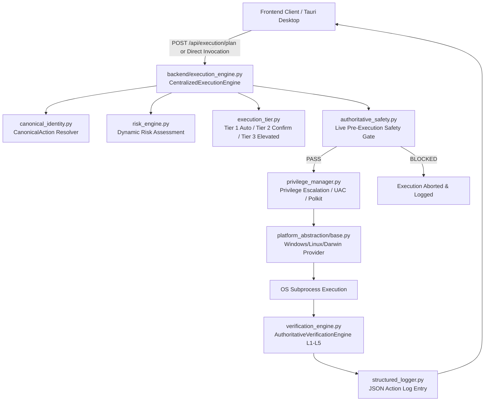
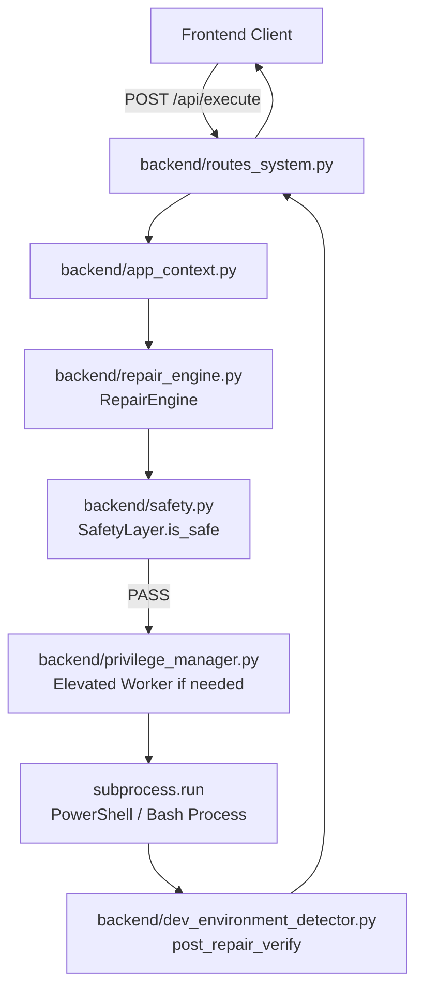
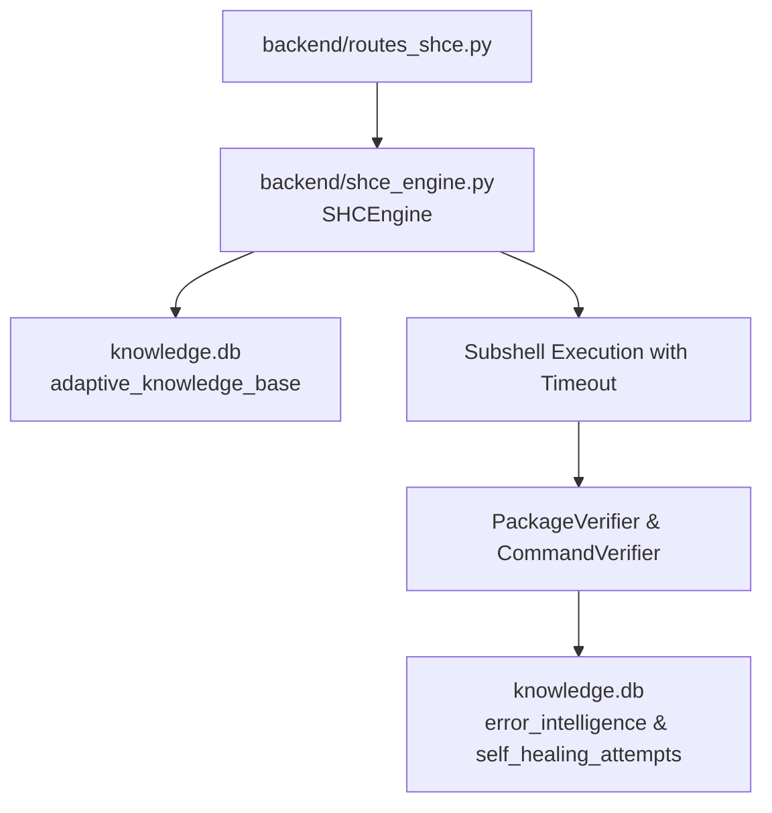

# EXECUTION PATH AUDIT

**Date**: 2026-09-15  
**Project**: PC Doctor  
**Status**: Authoritative Reference Graph for Execution Architecture  

---

## 1. Executive Summary

A comprehensive source-and-reference audit of the execution architecture revealed **two parallel execution pipelines** currently coexisting in the PC Doctor codebase:

1. **The Primary Authoritative Execution Architecture** (`backend/execution_engine.py`):
   - Centralized, end-to-end orchestrated pipeline (`CentralizedExecutionEngine`).
   - Unified lifecycle: Canonical identity resolution → Dynamic risk assessment (`risk_engine.py`) → Tier assignment (`execution_tier.py`) → Pre-execution safety gate (`authoritative_safety.py`) → Platform abstraction process execution → Multi-level verification (`verification_engine.py`) → Structured telemetry logging (`structured_logger.py`).
   - Covered by comprehensive automated test suites (`test_execution_verification_sync.py`, `test_authoritative_backend.py`, `test_platform_abstraction_contracts.py`).

2. **The Active Legacy Route Execution Architecture** (`backend/repair_engine.py`):
   - Direct repair engine (`RepairEngine`) loaded in `backend/app_context.py` and invoked by `backend/routes_system.py` (`POST /api/execute`, `POST /api/repair`).
   - Performs command generation, legacy safety validation (`safety.py`), elevation checks (`privilege_manager.py`), execution (`subprocess.run`), and post-repair verification (`dev_environment_detector.py`).
   - Retained as **Active Legacy** to guarantee zero breakage of existing UI routes until Phase 1 unified route migration.

3. **Dead Execution Paths**:
   - `backend/pipeline.py`: Prototype pipeline with 0 callers across the repository. Confirmed **DEAD / UNUSED**.

---

## 2. Component Responsibility Matrix

| Component | Executes Mutations? | Selects Recipes? | Calls Subprocess? | Safety Gate | Performs Elevation? | Triggers Verification? | Structured Logging? | Status |
|---|---|---|---|---|---|---|---|---|
| **`execution_engine.py`** | **Yes** | Yes (via `canonical_identity` / `recipe_engine`) | **Yes** (via platform abstraction) | `authoritative_safety.py` | Yes (via `execution_tier` & `PrivilegeManager`) | Yes (`verification_engine.py`) | Yes (`structured_logger.py`) | **PRIMARY AUTHORITATIVE** |
| **`repair_engine.py`** | **Yes** | Yes (`knowledge.db` recipes & FTS) | **Yes** (`subprocess.run`) | `safety.py` (`SafetyLayer`) | Yes (`privilege_manager.py`) | Yes (`dev_environment_detector`) | Yes (standard logger) | **ACTIVE LEGACY** |
| **`pipeline.py`** | **Yes** (internal) | Yes (`resolver.py`) | **Yes** (`subprocess.run`) | `risk_engine.py` | No | Yes (`verifier.py`) | Yes (internal dict) | **DEAD / UNUSED (0 imports)** |
| **`agent_orchestrator.py`** | **Yes** (via subtasks) | Yes (via LLM plan & KB search) | Yes (via tools) | `risk_engine.py` + dry run | No (delegated) | Yes (`verifier.py`) | Yes (`AgentMemory`) | **ACTIVE (Agent Mode)** |
| **`automation_engine.py`** | **Yes** (promotions) | Evaluates candidate fixes | No (orchestration) | Validation evidence check | No | Yes (verifies evidence status) | Yes | **ACTIVE (Background Automation)** |
| **`shce_engine.py`** | **Yes** (self-healing) | Yes (error intelligence & adaptive KB) | **Yes** (subshell timeout) | `safety_classifier` + `SafetyLayer` | Yes (`privilege_manager.py`) | Yes (`PackageVerifier`) | Yes (`error_intelligence`, `shce_queue`) | **ACTIVE (Self-Healing Core)** |
| **`routes_system.py`** | Delegates | Delegates | Delegates | `safety.py` pre-checks | Delegates | Delegates | Request logs | **ACTIVE (API Gateway)** |
| **`routes_shce.py`** | Delegates | Delegates | Delegates | SHCE safety | Delegates | Delegates | Request logs | **ACTIVE (SHCE Gateway)** |
| **`routes_agent.py`** | Delegates | Delegates | Delegates | Risk checks | Delegates | Delegates | Session logs | **ACTIVE (Agent Gateway)** |

---

## 3. Detailed Execution Path Tracing

### Path A: The Authoritative Architecture Path (Target Production Standard)

1. **Initiation**: Request arrives specifying target action or diagnostic finding.
2. **Canonical Resolution**: Identity canonicalized into unambiguous package/system operation.
3. **Risk & Tier Assessment**: `risk_engine.py` computes composite risk score (0–100); `execution_tier.py` assigns execution policy (`Tier 1` auto-run safe commands, `Tier 2` requires user UI prompt, `Tier 3` requires elevated administrator token).
4. **Authoritative Safety Gate**: `authoritative_safety.py` performs strict static AST blacklist validation, injection pattern analysis, and OS-mismatch filtering.
5. **Elevation Management**: `privilege_manager.py` spawns worker via elevated IPC or direct runner if privileged.
6. **Platform Abstraction**: Execution routes through platform provider (`WindowsPlatformProvider`, `LinuxPlatformProvider`, or `MacOSPlatformProvider`).
7. **Verification**: `verification_engine.py` runs L1 (binary existence), L2 (exit code & version), L3 (functional sanity probe), and L5 (environment configuration) verification with backoff retry.
8. **Logging**: Action event with complete telemetry recorded to structured log.

---

### Path B: The Live Active Legacy Route Path (`routes_system.py` → `repair_engine.py`)

1. **Live Route Binding**:
   - `backend/routes_system.py` line 14: `from app_context import engine, scanner, safety, vector_searcher`.
   - In `execute_command(...)`: calls `engine.execute_repair(...)` or `engine._execute_cmd(...)`.
2. **Safety Enforcement**:
   - `safety.py` validates command syntax and flags unsafe tokens (`rm -rf /`, formatting, drops).
3. **Elevation Routing**:
   - If elevation is needed, `RepairEngine` calls `privilege_manager.run_with_elevation(...)`.
4. **Verification**:
   - After execution, calls `dev_environment_detector.dev_environment_detector.post_repair_verify(tool_name)`.
5. **Significance**:
   - This path is directly consumed by the current Single Page Application (SPA) frontend tabs (`Repair`, `DevTools`, `System`). It cannot be deleted in Task 0.5 without breaking the running application.

---

### Path C: The Self-Healing Core Path (`shce_engine.py`)

- Autonomous self-healing execution loop.
- Manages dynamic error signature matching, candidate remediation evaluation, subshell execution, and adaptive solution persistence.
- Tested by 54 tests in `tests/test_shce.py`. Retained as **Active Autonomous Path**.

---

### Path D: The Dead Prototype Path (`pipeline.py`)

- Defines `PipelineResult` and `execute_pipeline(...)`.
- **References**: Zero (0) files import or invoke `backend/pipeline.py`.
- **Relationship**: An early monolithic prototype created prior to the separation of `execution_engine.py`, `plan_freeze.py`, and `agent_orchestrator.py`.
- **Verdict**: Conclusively dead code. Safely removable without any effect on tests or runtime.

---

## 4. Architectural Findings & Roadmap Guidance for Phase 1

1. **Dualism Identified**: The codebase has two parallel execution engines (`CentralizedExecutionEngine` in `execution_engine.py` and `RepairEngine` in `repair_engine.py`).
2. **Controlled State for Task 0.5**:
   - `execution_engine.py`: **AUTHORITATIVE / ACTIVE**.
   - `repair_engine.py`: **ACTIVE BUT LEGACY** (freeze, preserve intact for live routes).
   - `pipeline.py`: **DEAD / UNUSED** (safe to delete).
3. **Phase 1 Action**:
   - Repoint `routes_system.py` endpoints to invoke `CentralizedExecutionEngine`.
   - Deprecate `RepairEngine` after validating that all 80 API routes and UI flows use `CentralizedExecutionEngine`.
