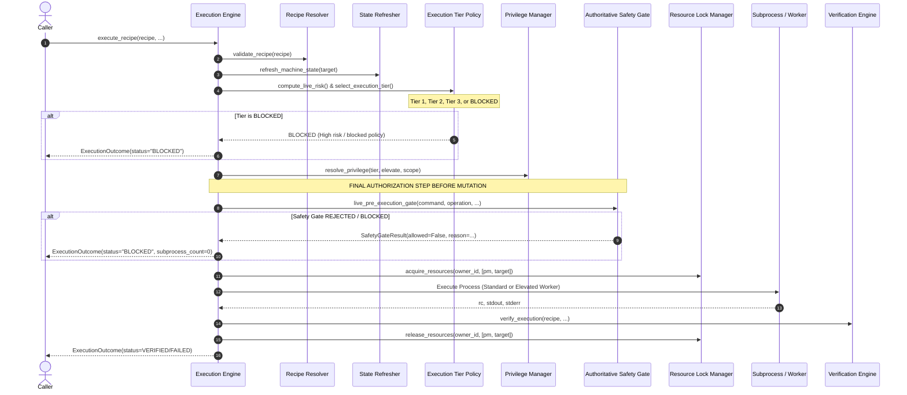

# STAGE 5 — AUTHORITATIVE SAFETY GATE AUDIT

**Date**: 2026-09-17  
**Scope**: Authoritative Safety Gate & Last-Mile Pre-Execution Safety Hardening  
**Baseline Health**: 325/325 Tests Passing  

---

## 1. Executive Summary & Objective

In Stages 1–4, PC Doctor established:
- Consolidated execution pipeline with single production route (`backend/execution_engine.py`).
- Generic verification pipeline and effective environment refresh (`backend/verification_engine.py`, `backend/state_refresh.py`).
- Normalized machine state and pure, configurable tier policy (`backend/machine_state.py`, `backend/execution_tier.py`).

Stage 5 focuses exclusively on **authoritative safety gate hardening**.
The cardinal invariant of this stage is:
$$\text{Tier 3 (Full Protected / Admin)} \ne \text{Allowed to Execute}$$

Tier selection specifies the **required protection level, user approval workflow, and elevation requirements**.
The Authoritative Safety Gate (`authoritative_safety.live_pre_execution_gate`) decides whether the mutation is **currently safe and permitted to execute** on the host. A hard tier override (e.g. `bcdedit`, `netsh`, `net user`) escalates the tier to Tier 3, but **must never bypass the live safety gate**. If the operation is prohibited or destructive, the safety gate must block execution and ensure zero subprocesses are spawned.

---

## 2. Current Safety Implementation Audit

### 2.1 File Inventory & Responsibilities
| File | Current Role | Strengths | Gaps / Vulnerabilities |
| :--- | :--- | :--- | :--- |
| `backend/authoritative_safety.py` | Authoritative safety gate (`AuthoritativeSafetyLayer`) called by `execution_engine.py` and `plan_freeze.py`. | Centralized pre-execution check. Hard blacklist for destructive patterns. Basic disk/RAM threshold checks. | Does not inspect `MachineState` (`pending_reboot`, `dependency_lock`, `package_manager_available`). Does not integrate `ResourceLockManager`. Lacks safety cache with invalidation. |
| `backend/safety.py` | Legacy `SafetyLayer` with extensive regexes (`BLACKLIST_PATTERNS`, `HIGH_RISK_PATTERNS`, `HOST_PROTECTED_PATTERNS`). | Broad pattern library for package-manager actions, maintenance tasks, and OS mismatches. | Dual safety implementation; not strictly called in the modern authoritative pipeline path. |
| `backend/execution_engine.py` | Authoritative single-route execution pipeline (`execute_recipe`, `stream_execute_command`). | Calls `live_pre_execution_gate` immediately prior to mutation. | Refreshes `MachineState` for tier selection, but does not pass `MachineState`, `pm`, or recipe metadata to `live_pre_execution_gate`. |
| `backend/execution_tier.py` | Pure tier policy engine (`select_execution_tier`). | Decoupled from OS APIs. Contains hard overrides (`check_hard_safety_override`). | Relies on downstream execution engine to enforce that hard overrides still pass through the safety gate. |
| `backend/plan_freeze.py` | Frozen batch plans & fine-grained concurrency locking (`ResourceLockManager`). | Evaluates `live_pre_execution_gate` per step before mutation. | `ResourceLockManager` is not evaluated by `live_pre_execution_gate` to check if a resource is already locked by a conflicting operation. |
| `backend/privilege_manager.py` | Structured elevation state machine. | Manages UAC and elevated worker execution. | Executes elevated operations only after safety gate authorization. |

---

## 3. Production Call Path & Exact Decision Location

In `backend/execution_engine.py` (`execute_recipe` and `stream_execute_command`), the execution lifecycle proceeds through 8 sequential stages:

### Exact Location of Final Safety Decision:
- `backend/execution_engine.py:732` (in `execute_recipe`):
  `safety_res = authoritative_safety.live_pre_execution_gate(command=clean_cmd, operation=operation, is_static_recipe=(source == "STATIC_DB"))`
- `backend/execution_engine.py:1072` (in `stream_execute_command`):
  `safety_res = authoritative_safety.live_pre_execution_gate(command=clean_cmd, operation=operation, is_static_recipe=(source == "STATIC_DB"))`
- `backend/plan_freeze.py:144` (in `evaluate_step_live_safety_gate`):
  `res = authoritative_safety.live_pre_execution_gate(command=cmd, operation=step.recipe.operation.value, ...)`

---

## 4. Analysis of Safety Gaps & Hardening Plan

### 4.1 Tier Selection vs. Safety Gate Separation
- **Current State**: Tier 3 is selected when risk is moderate-to-high, elevation is needed, or a hard override triggers (`bcdedit`, `netsh`, `net user`).
- **Gap**: While `execution_engine.py` calls `live_pre_execution_gate` after tier selection, `live_pre_execution_gate` lacks explicit checks for destructive subcommands of hard overrides (e.g., `bcdedit /delete`, `net user ... /delete`, `netsh advfirewall set allprofiles state off`). If not blocked by the safety gate, a hard override would proceed to execute with elevated privileges!
- **Hardening Requirement**: Add explicit prohibited patterns for dangerous system alterations in `HARD_BLACKLIST` or `HOST_PROTECTED_PATTERNS`. Ensure that even when `tier == TIER_3_FULL_PROTECTED`, the safety gate returns `allowed=False` with `DESTRUCTIVE_OPERATION` or `SAFETY_POLICY_REJECTED` and prevents subprocess spawning.

### 4.2 Natural-Language Command Rejection
- **Current State**: `is_natural_language_command` checks obvious comments, ending punctuation, and a fixed set of advisory phrases.
- **Gap**: Sentences starting with imperative verbs (e.g. `"fix my git"`, `"restart the service for me"`, `"install java for me"`) are not matched because `"fix"` and `"restart"` are not recognized as natural language tokens unless accompanied by specific keywords.
- **Hardening Requirement**: Harden `is_natural_language_command` to inspect imperative English phrases combined with pronouns/articles (`"my"`, `"the"`, `"your"`, `"for me"`). Ensure subprocess spawn count is strictly 0.

### 4.3 Pending-Reboot Safety Policy
- **Current State**: `MachineState.pending_reboot` is collected by platform providers and passed to tier selection (disqualifying Fast Path).
- **Gap**: `live_pre_execution_gate` does not inspect `pending_reboot`.
- **Hardening Requirement**:
  - Distinguish safe/query commands (e.g. `git --version`, diagnostics) from mutations.
  - Define policy: Mutating operations that install system drivers, kernel modules, or low-level components when `pending_reboot=True` must be blocked or require explicit confirmation (`REQUIRES_REBOOT` or `WARNING`).

### 4.4 Dependency & Resource Lock Integration
- **Current State**: `ResourceLockManager` in `plan_freeze.py` manages in-process fine-grained resource locks, but `live_pre_execution_gate` does not check if target resources are locked prior to entering lock acquisition. Furthermore, `MachineState.dependency_lock` (e.g., external Windows Installer mutex `InProgress` or dpkg lock) is not evaluated by the safety gate.
- **Hardening Requirement**:
  - Connect `ResourceLockManager` and `MachineState.dependency_lock` into `live_pre_execution_gate`.
  - If target resource (`pm:winget`, `tool:git`) is locked by another owner, or if host reports `dependency_lock=True`, block with `RESOURCE_LOCKED` (recoverable).

### 4.5 Package-Manager Availability Handling
- **Current State**: If a package manager is not installed, the command fails downstream during process execution or verification.
- **Gap**: The safety gate should detect a missing package manager upfront instead of blindly invoking a nonexistent executable.
- **Hardening Requirement**:
  - In `live_pre_execution_gate`, verify availability of invoked package managers (`winget`, `choco`, `apt`, `brew`, etc.) using `shutil.which` or platform adapter.
  - If missing, return `allowed=False` with `BlockedReason.PACKAGE_MANAGER_UNAVAILABLE`.

### 4.6 OS & Platform Mismatch
- **Current State**: `live_pre_execution_gate` has basic string-prefix checks (`sudo`, `apt`, `winget`).
- **Gap**: Does not utilize `StructuredRecipe.os` or `CanonicalIdentity` metadata.
- **Hardening Requirement**: If `recipe` is provided and `recipe.os != "Any"` and does not match `platform.system()`, reject upfront with `BlockedReason.UNSUPPORTED_METHOD` or `PLATFORM_MISMATCH`.

### 4.7 Host & Internal PC Doctor Resource Protection
- **Current State**: `HOST_PROTECTED_PATTERNS` checks Linux kernel packages and display drivers.
- **Gap**: No explicit guard prevents commands from mutating PC Doctor's own internal directories, database files (`knowledge*.db`), or configuration files.
- **Hardening Requirement**: Add `is_protected_pc_doctor_resource(path/command)`. Reject any mutation targeting PC Doctor codebase or database files with `SAFETY_POLICY_REJECTED`.

### 4.8 Safety Result Model
- **Current State**: `BlockedReason` enum contains 9 values.
- **Hardening Requirement**: Expand `BlockedReason` to include `PACKAGE_MANAGER_UNAVAILABLE`, `RESOURCE_LOCKED`, and `REQUIRES_REBOOT` to preserve canonical categorization without arbitrary string errors.

### 4.9 Safety Cache with Invalidation
- **Current State**: No caching in `authoritative_safety.py`.
- **Hardening Requirement**: Implement `SafetyEvaluationCache` with TTL and invalidation on:
  - Recipe changes
  - OS / architecture changes
  - Machine state changes (`pending_reboot`, `low_disk_space`, `dependency_lock`)
  - Resource lock acquisition/release
  - Explicit invalidation.
- Crucially, the last-mile dynamic checks (disk, locks, reboot) must always be validated against current host state.

---

## 5. Implementation Roadmap for Stage 5

1. **`backend/authoritative_safety.py`**:
   - Expand `BlockedReason` with canonical reasons.
   - Harden `is_natural_language_command`.
   - Add destructive pattern rules for hard override commands.
   - Add internal PC Doctor resource protection.
   - Update `live_pre_execution_gate` signature and logic to consume `recipe`, `machine_state`, `package_manager`, and `resource_lock_mgr`.
   - Implement `SafetyEvaluationCache` with explicit invalidation.
2. **`backend/execution_engine.py`**:
   - Pass `recipe`, `machine_state`, `pm`, and target resource to `live_pre_execution_gate`.
3. **`backend/plan_freeze.py`**:
   - Update `evaluate_step_live_safety_gate` to pass current machine state and recipe context.
4. **`tests/test_authoritative_safety_hardening.py`**:
   - Implement 14+ required unit and integration tests proving all safety guarantees with mock subprocesses.
5. **Live Verification & Regression Run**:
   - Verify real Git MVP execution route.
   - Run full 325-test baseline + new tests to ensure 100% pass rate.
6. **Documentation**:
   - Produce `STAGE5_SAFETY_HARDENING_RESULT.md`.
